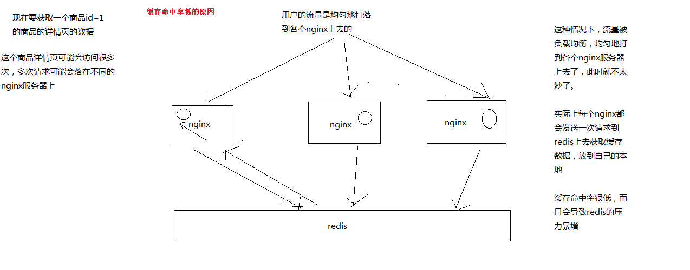

# 亿级流量系统架构

## Override

[如何支撑百亿级数据的存储与计算](https://mp.weixin.qq.com/s/eqtR9QAMIm3F4QnGut1vrA)

[如何设计高容错分布式计算系统](https://mp.weixin.qq.com/s/Omzkr-9BoL3GjyiWn9Nhdg)

[如何设计承载百亿流量的高性能架构](https://mp.weixin.qq.com/s/o8rZwDGkJwPxHsPpBcQh9w)

[如何设计每秒十万查询的高并发架构](https://mp.weixin.qq.com/s/o8rZwDGkJwPxHsPpBcQh9w)

[如何设计全链路99.99%高可用架构](https://mp.weixin.qq.com/s/3-eWMVje_PWnwGmsZZBJog)

[亿级流量系统架构之如何在上万并发场景下设计可扩展架构（上）？](https://mp.weixin.qq.com/s/8zHlTwTQkl3LNS5beOf5AA)

[亿级流量系统架构之如何在上万并发场景下设计可扩展架构（中）？](https://mp.weixin.qq.com/s/ThoeXs-Dz7xbs-Nl7Mbfag)

[亿级流量系统架构之如何在上万并发场景下设计可扩展架构（下）？](https://mp.weixin.qq.com/s/f4We1V8EAIyM8wpvwAHmwQ)

[专栏总结](https://mp.weixin.qq.com/s/AkZn-RjXcZYdZ2PjQ8_YHA)

[如何保证百亿流量下的数据一致性（上）](https://mp.weixin.qq.com/s/hh-kpRLwKRLLK8fG-5jzTQ)

[如何保证百亿流量下的数据一致性（中）？](https://mp.weixin.qq.com/s/suPMfwaXc4ze_csS2WfzHA)

[如何保证百亿流量下的数据一致性（下）？](https://mp.weixin.qq.com/s/TdGiiBzaOTo1TeY40NpSTw)

[互联网面试必杀：如何保证消息中间件全链路数据100%不丢失（1）](https://mp.weixin.qq.com/s/uqWIf0MAet_StszuOrZCwQ)

[互联网面试必杀：如何保证消息中间件全链路数据100%不丢失（2）](https://mp.weixin.qq.com/s/9SFrwaCCLnNyuCqP_KQ0zw)

[数据一致性重构的食用指南](https://mp.weixin.qq.com/s/bZwhgi9MFioSmfPeb9tcsg)

[面试大杀器：消息中间件如何实现消费吞吐量的百倍优化？](https://mp.weixin.qq.com/s/vZ4KVC2eGmssnQUyIKgzfw)

[高并发场景下，如何保证生产者投递到消息中间件的消息不丢失？](https://mp.weixin.qq.com/s/r2_o5wa6Gn94NY4ViRnjpA)

[用大白话给你讲小白都能看懂的分布式系统容错架构](https://mp.weixin.qq.com/s/DKf63ZDJQKoEiOmGqn3NxQ)

[你的系统如何支撑高并发？](https://mp.weixin.qq.com/s/nh_a_ea0JDNFqWJbgRRmNA)

[支撑百万连接的系统应该如何设计其高并发架构？](https://mp.weixin.qq.com/s/12MVd1i-ZRyohI4rh9P4uw)

[如何设计一个百万级的消息推送系统](https://mp.weixin.qq.com/s/wCbBKCR2CIKAOMdBsoj2pQ)


## 如何设计每秒十万查询的高并发架构

### 4.1.分库分表 + 读写分离

### 4.2.每秒10万查询的高并发挑战

统计数据:99%请求为当日数据(热数据),1%请求为历史数据(冷数据)

### 4.3.数据的冷热分离架构

将今日实时计算出来的热数据放在一个MySQL集群里，将离线计算出来的冷数据放在另外一个MySQL集群里

然后开发一个数据查询平台,封装底层的多个MySQL集群,根据查询条件动态路由到热数据存储或者是冷数据存储

### 4.4.冷数据存储和查询的问题

问题:

1).冷数据的数据量不断增长,mysql需要不断扩容

2).分库、分表后,库和表维护麻烦

解决:
ES+HBase+内存的SQL计算引擎

[Elasticsearch+Hbase实现海量数据秒级查询](https://blog.csdn.net/sdksdk0/article/details/53966430)

先决条件:入库时,冗余字段,避免表关联

步骤:
1). where条件,先走ES的分布式高性能索引查询，ES可以针对海量数据高性能的检索出来需要的那部分数据


2). 将检索出来的数据对应的完整的各个数据字段，从HBase里提取出来，拼接成完成的数据

3). 将这份数据集放在内存里，进行复杂的函数计算、分组聚合以及排序等操作

### 4.5.实时数据存储引入缓存集群

缓存集群:实时数据每次更新后写入的时候,都是写数据库集群同时还写缓存集群的,是双写的方式

### 4.6.总结

热数据基于缓存集群+数据库集群来承载高并发的每秒十万级别的查询

冷数据基于ES+HBase+内存计算的自研查询引擎来支撑海量数据存储以及高性能查询

热数据查询响应时间:几十毫秒

冷数据查询响应时间:200毫秒以内


### 高并发连接

[一步步动手实现高并发的Reactor模型 —— Kafka底层如何充分利用多线程优势去处理网络I/O与业务分发](https://my.oschina.net/anur/blog/2988177)


# 亿级流量、高并发与高性能场景下的电商详情页大型缓存架构实战

### 04_大型电商网站的异步多级缓存构建+nginx数据本地化动态渲染的架构

模板，可能所有的页面要重新渲染，很坑，大网站


参考: 乐优商城 Rabbitmq及数据同步

#### nginx请求数据，动态渲染网页模板
分发层nginx，lua应用，会将商品id，商品店铺id，都转发到后端的应用nginx


1、应用nginx的lua脚本接收到请求
2、获取请求参数中的商品id，以及商品店铺id
3、根据商品id和商品店铺id，在nginx本地缓存中尝试获取数据
4、如果在nginx本地缓存中没有获取到数据，那么就到redis分布式缓存中获取数据，如果获取到了数据，还要设置到nginx本地缓存中


但是这里有个问题，建议不要用nginx+lua直接去获取redis数据
因为openresty没有太好的redis cluster的支持包，所以建议是发送http请求到缓存数据生产服务，由该服务提供一个http接口

缓存数生产服务可以基于redis cluster api从redis中直接获取数据，并返回给nginx


下载相关http的lua包
> cd /usr/hello/lualib/resty/  

> wget https://raw.githubusercontent.com/pintsized/lua-resty-http/master/lib/resty/http_headers.lua  

> wget https://raw.githubusercontent.com/pintsized/lua-resty-http/master/lib/resty/http.lua 


5、如果缓存数据生产服务没有在redis分布式缓存中没有获取到数据，那么就在自己本地ehcache中获取数据，返回数据给nginx，也要设置到nginx本地缓存中


6、如果ehcache本地缓存都没有数据，那么就需要去原始的服务中拉去数据，该服务会从mysql中查询，拉去到数据之后，返回给nginx，并重新设置到ehcache和redis中


这里先不考虑，后面要专门讲解一套分布式缓存重建并发冲突的问题和解决方案


7、nginx最终利用获取到的数据，动态渲染网页模板


下载网页模板相关的lua包
> cd /usr/hello/lualib/resty/
> wget https://raw.githubusercontent.com/bungle/lua-resty-template/master/lib/resty/template.lua
> mkdir /usr/hello/lualib/resty/html
> cd /usr/hello/lualib/resty/html
> wget https://raw.githubusercontent.com/bungle/lua-resty-template/master/lib/resty/template/html.lua


在/usr/hello/hello.conf的server中配置模板位置  
vi  /usr/hello/hello.conf
set $template_location "/templates";  
set $template_root "/usr/hello/templates";

创建目录并新建页面
mkdir /usr/hello/templates
vi /usr/hello/templates/product.html
```html
<html>
     <head>
            <meta http-equiv="Content-Type" content="text/html; charset=UTF-8">
            <title>商品详情页</title>
    </head>
    <body>
        商品id: {* productId *}<br/>
        商品名称: {* productName *}<br/>
        商品图片列表: {* productPictureList *}<br/>
        商品规格: {* productSpecification *}<br/>
        商品售后服务: {* productService *}<br/>
        商品颜色: {* productColor *}<br/>
        商品大小: {* productSize *}<br/>
        店铺id: {* shopId *}<br/>
        店铺名称: {* shopName *}<br/>
        店铺等级: {* shopLevel *}<br/>
        店铺好评率: {* shopGoodCommentRate *}<br/>
    </body>
</html>
```


8、将渲染后的网页模板作为http响应，返回给分发层nginx


在 vi /usr/servers/nginx/conf/nginx.conf中的http加入：
lua_shared_dict my_cache 128m;
创建lua脚本
vi /usr/hello/lua/product.lua

lua脚本中：

```lua
local uri_args = ngx.req.get_uri_args()
local productId = uri_args["productId"]
local shopId = uri_args["shopId"]
local cache_ngx = ngx.shared.my_cache
local productCacheKey = "product_info_"..productId
local shopCacheKey = "shop_info_"..shopId
local productCache = cache_ngx:get(productCacheKey)
local shopCache = cache_ngx:get(shopCacheKey)
if productCache == "" or productCache == nil then
local http = require("resty.http")
local httpc = http.new()
local resp, err = httpc:request_uri("http://192.168.31.179:8080",{
  method = "GET",
  path = "/getProductInfo?productId="..productId
})
productCache = resp.body
cache_ngx:set(productCacheKey, productCache, 10 * 60)
end


if shopCache == "" or shopCache == nil then
local http = require("resty.http")
local httpc = http.new()
local resp, err = httpc:request_uri("http://192.168.31.179:8080",{
  method = "GET",
  path = "/getShopInfo?shopId="..shopId
})
shopCache = resp.body
cache_ngx:set(shopCacheKey, shopCache, 10 * 60)
end

local cjson = require("cjson")
local productCacheJSON = cjson.decode(productCache)
local shopCacheJSON = cjson.decode(shopCache)

local context = {
productId = productCacheJSON.id,
productName = productCacheJSON.name,
productPrice = productCacheJSON.price,
productPictureList = productCacheJSON.pictureList,
productSpecification = productCacheJSON.specification,
productService = productCacheJSON.service,
productColor = productCacheJSON.color,
productSize = productCacheJSON.size,
shopId = shopCacheJSON.id,
shopName = shopCacheJSON.name,
shopLevel = shopCacheJSON.level,
shopGoodCommentRate = shopCacheJSON.goodCommentRate
}

local template = require("resty.template")
template.render("product.html", context)
```


重启nginx
> cd/usr/servers/nginx/sbin/nginx -s reload

### 14_redis如何通过读写分离来承载读请求QPS超过10万+？


1、redis高并发跟整个系统的高并发之间的关系

redis，你要搞高并发的话，不可避免，要把底层的缓存搞得很好

mysql，高并发，做到了，那么也是通过一系列复杂的分库分表，订单系统，事务要求的，QPS到几万，比较高了

要做一些电商的商品详情页，真正的超高并发，QPS上十万，甚至是百万，一秒钟百万的请求量

光是redis是不够的，但是redis是整个大型的缓存架构中，支撑高并发的架构里面，非常重要的一个环节

首先，你的底层的缓存中间件，缓存系统，必须能够支撑的起我们说的那种高并发，其次，再经过良好的整体的缓存架构的设计（多级缓存架构、热点缓存），支撑真正的上十万，甚至上百万的高并发


2、redis不能支撑高并发的瓶颈在哪里？

​	单机

redis单机的瓶颈


3、如果redis要支撑超过10万+的并发，那应该怎么做？

单机的redis几乎不太可能说QPS超过10万+，除非一些特殊情况，比如你的机器性能特别好，配置特别高，物理机，维护做的特别好，而且你的整体的操作不是太复杂

单机在几万

读写分离，一般来说，对缓存，一般都是用来支撑读高并发的，写的请求是比较少的，可能写请求也就一秒钟几千，一两千

大量的请求都是读，一秒钟二十万次读

读写分离

主从架构 -> 读写分离 -> 支撑10万+读QPS的架构


redis主从实现读写分离支撑10万+的高并发


4、接下来要讲解的一个topic

​	redis replication

​	redis主从架构 -> 读写分离架构 -> 可支持水平扩展的读高并发架构


### 31_redis_cluster的自动化slaver迁移实现更强的高可用架构的部署方案

slave的自动迁移

比如现在有10个master，每个有1个slave，然后新增了3个slave作为冗余，有的master就有2个slave了，有的master出现了salve冗余

如果某个master的slave挂了，那么redis cluster会自动迁移一个冗余的slave给那个master

只要多加一些冗余的slave就可以了

为了避免的场景，就是说，如果你每个master只有一个slave，万一说一个slave死了，然后很快，master也死了，那可用性还是降低了

但是如果你给整个集群挂载了一些冗余slave，那么某个master的slave死了，冗余的slave会被自动迁移过去，作为master的新slave，此时即使那个master也死了

还是有一个slave会切换成master的

之前有一个master是有冗余slave的，直接让其他master其中的一个slave死掉，然后看有冗余slave会不会自动挂载到那个master


### 48_redis的LRU缓存清除算法讲解以及相关配置使用

之前给大家讲解过，多级缓存架构，缓存数据生产服务，监听各个数据源服务的数据变更的消息，得到消息之后，然后调用接口拉去数据

将拉去到的数据，写入本地ehcache缓存一份，spring boot整合，演示过

数据写入redis分布式缓存中一份，你不断的将数据写入redis，写入redis，然后redis的内存是有限的，每个redis实例最大一般也就是设置给10G

那如果你不断的写入数据，当数据写入的量超过了redis能承受的范围之后，改该怎么玩儿呢？？？

redis是会在数据达到一定程度之后，超过了一个最大的限度之后，就会将数据进行一定的清理，从内存中清理掉一些数据

只有清理掉一些数据之后，才能将新的数据写入内存中

1、LRU算法概述

redis默认情况下就是使用LRU策略的，因为内存是有限的，但是如果你不断地往redis里面写入数据，那肯定是没法存放下所有的数据在内存的

所以redis默认情况下，当内存中写入的数据很满之后，就会使用LRU算法清理掉部分内存中的数据，腾出一些空间来，然后让新的数据写入redis缓存中

LRU：Least Recently Used，最近最少使用算法

将最近一段时间内，最少使用的一些数据，给干掉。比如说有一个key，在最近1个小时内，只被访问了一次; 还有一个key在最近1个小时内，被访问了1万次

这个时候比如你要将部分数据给清理掉，你会选择清理哪些数据啊？肯定是那个在最近小时内被访问了1万次的数据

2、缓存清理设置

redis.conf

maxmemory，设置redis用来存放数据的最大的内存大小，一旦超出这个内存大小之后，就会立即使用LRU算法清理掉部分数据

如果用LRU，那么就是将最近最少使用的数据从缓存中清除出去

对于64 bit的机器，如果maxmemory设置为0，那么就默认不限制内存的使用，直到耗尽机器中所有的内存为止; 但是对于32 bit的机器，有一个隐式的闲置就是3GB

maxmemory-policy，可以设置内存达到最大闲置后，采取什么策略来处理

（1）noeviction: 如果内存使用达到了maxmemory，client还要继续写入数据，那么就直接报错给客户端
（2）allkeys-lru: 就是我们常说的LRU算法，移除掉最近最少使用的那些keys对应的数据
（3）volatile-lru: 也是采取LRU算法，但是仅仅针对那些设置了指定存活时间（TTL）的key才会清理掉
（4）allkeys-random: 随机选择一些key来删除掉
（5）volatile-random: 随机选择一些设置了TTL的key来删除掉
（6）volatile-ttl: 移除掉部分keys，选择那些TTL时间比较短的keys

在redis里面，写入key-value对的时候，是可以设置TTL，存活时间，比如你设置了60s。那么一个key-value对，在60s之后就会自动被删除

redis的使用，各种数据结构，list，set，等等

allkeys-lru

这边拓展一下思路，对技术的研究，一旦将一些技术研究的比较透彻之后，就喜欢横向对比底层的一些原理

storm，科普一下

玩儿大数据的人搞得，领域，实时计算领域，storm

storm有很多的流分组的一些策略，按shuffle分组，global全局分组，direct直接分组，fields按字段值hash后分组

分组策略也很多，但是，真正公司里99%的场景下，使用的也就是shuffle和fields，两种策略

redis，给了这么多种乱七八糟的缓存清理的算法，其实真正常用的可能也就那么一两种，allkeys-lru是最常用的

3、缓存清理的流程

（1）客户端执行数据写入操作
（2）redis server接收到写入操作之后，检查maxmemory的限制，如果超过了限制，那么就根据对应的policy清理掉部分数据
（3）写入操作完成执行


4、redis的LRU近似算法

科普一个相对来说稍微高级一丢丢的知识点

redis采取的是LRU近似算法，也就是对keys进行采样，然后在采样结果中进行数据清理

redis 3.0开始，在LRU近似算法中引入了pool机制，表现可以跟真正的LRU算法相当，但是还是有所差距的，不过这样可以减少内存的消耗

redis LRU算法，是采样之后再做LRU清理的，跟真正的、传统、全量的LRU算法是不太一样的

maxmemory-samples，比如5，可以设置采样的大小，如果设置为10，那么效果会更好，不过也会耗费更多的CPU资源


### 51_基于“分发层+应用层”双层nginx架构提升缓存命中率方案分析


1、缓存命中率低

缓存数据生产服务那一层已经搞定了，相当于三层缓存架构中的本地堆缓存+redis分布式缓存都搞定了

就要来做三级缓存中的nginx那一层的缓存了

如果一般来说，你默认会部署多个nginx，在里面都会放一些缓存，就默认情况下，此时缓存命中率是比较低的




2、如何提升缓存命中率

分发层+应用层，双层nginx

分发层nginx，负责流量分发的逻辑和策略，这个里面它可以根据你自己定义的一些规则，比如根据productId去进行hash，然后对后端的nginx数量取模

将某一个商品的访问的请求，就固定路由到一个nginx后端服务器上去，保证说只会从redis中获取一次缓存数据，后面全都是走nginx本地缓存了

后端的nginx服务器，就称之为应用服务器; 最前端的nginx服务器，被称之为分发服务器

看似很简单，其实很有用，在实际的生产环境中，可以大幅度提升你的nginx本地缓存这一层的命中率，大幅度减少redis后端的压力，提升性能


### 69_缓存预热解决方案：基于storm实时热点统计的分布式并行缓存预热

0、缓存预热

缓存冷启动，redis启动后，一点数据都没有，直接就对外提供服务了，mysql就裸奔

（1）提前给redis中灌入部分数据，再提供服务
（2）肯定不可能将所有数据都写入redis，因为数据量太大了，第一耗费的时间太长了，第二根本redis容纳不下所有的数据
（3）需要根据当天的具体访问情况，实时统计出访问频率较高的热数据
（4）然后将访问频率较高的热数据写入redis中，肯定是热数据也比较多，我们也得多个服务并行读取数据去写，并行的分布式的缓存预热
（5）然后将灌入了热数据的redis对外提供服务，这样就不至于冷启动，直接让数据库裸奔了


1、nginx+lua将访问流量上报到kafka中

要统计出来当前最新的实时的热数据是哪些，我们就得将商品详情页访问的请求对应的流浪，日志，实时上报到kafka中


2、storm从kafka中消费数据，实时统计出每个商品的访问次数，访问次数基于LRU内存数据结构的存储方案

优先用内存中的一个LRUMap去存放，性能高，而且没有外部依赖

我之前做过的一些项目，不光是这个项目，还有很多其他的，一些广告计费类的系统，storm

否则的话，依赖redis，我们就是要防止redis挂掉数据丢失的情况，就不合适了; 用mysql，扛不住高并发读写; 用hbase，hadoop生态系统，维护麻烦，太重了

其实我们只要统计出最近一段时间访问最频繁的商品，然后对它们进行访问计数，同时维护出一个前N个访问最多的商品list即可

热数据，最近一段时间，可以拿到最近一段，比如最近1个小时，最近5分钟，1万个商品请求，统计出最近这段时间内每个商品的访问次数，排序，做出一个排名前N的list

计算好每个task大致要存放的商品访问次数的数量，计算出大小

然后构建一个LRUMap，apache commons collections有开源的实现，设定好map的最大大小，就会自动根据LRU算法去剔除多余的数据，保证内存使用限制

即使有部分数据被干掉了，然后下次来重新开始计数，也没关系，因为如果它被LRU算法干掉，那么它就不是热数据，说明最近一段时间都很少访问了


3、每个storm task启动的时候，基于zk分布式锁，将自己的id写入zk同一个节点中


4、每个storm task负责完成自己这里的热数据的统计，每隔一段时间，就遍历一下这个map，然后维护一个前3个商品的list，更新这个list


5、写一个后台线程，每隔一段时间，比如1分钟，都将排名前3的热数据list，同步到zk中去，存储到这个storm task对应的一个znode中去


6、我们需要一个服务，比如说，代码可以跟缓存数据生产服务放一起，但是也可以放单独的服务

服务可能部署了很多个实例

每次服务启动的时候，就会去拿到一个storm task的列表，然后根据taskid，一个一个的去尝试获取taskid对应的znode的zk分布式锁

如果能获取到分布式锁的话，那么就将那个storm task对应的热数据的list取出来

然后将数据从mysql中查询出来，写入缓存中，进行缓存的预热，多个服务实例，分布式的并行的去做，基于zk分布式锁做了协调了，分布式并行缓存的预热

### 70_基于nginx+lua完成商品详情页访问流量实时上报kafka的开发

在nginx这一层，接收到访问请求的时候，就把请求的流量上报发送给kafka

这样的话，storm才能去消费kafka中的实时的访问日志，然后去进行缓存热数据的统计

用得技术方案非常简单，从lua脚本直接创建一个kafka producer，发送数据到kafka

> wget https://github.com/doujiang24/lua-resty-kafka/archive/master.zip

> yum install -y unzip

> unzip lua-resty-kafka-master.zip

> cp -rf /usr/local/lua-resty-kafka-master/lib/resty /usr/hello/lualib

> nginx -s reload

```shell script
local cjson = require("cjson")  
local producer = require("resty.kafka.producer")  

local broker_list = {  
    { host = "192.168.31.187", port = 9092 },  
    { host = "192.168.31.19", port = 9092 },  
    { host = "192.168.31.227", port = 9092 }
}

local log_json = {}  
log_json["headers"] = ngx.req.get_headers()  
log_json["uri_args"] = ngx.req.get_uri_args()  
log_json["body"] = ngx.req.read_body()  
log_json["http_version"] = ngx.req.http_version()  
log_json["method"] =ngx.req.get_method() 
log_json["raw_reader"] = ngx.req.raw_header()  
log_json["body_data"] = ngx.req.get_body_data()  

local message = cjson.encode(log_json);  

local productId = ngx.req.get_uri_args()["productId"]

local async_producer = producer:new(broker_list, { producer_type = "async" })   
local ok, err = async_producer:send("access-log", productId, message)  

if not ok then  
    ngx.log(ngx.ERR, "kafka send err:", err)  
    return  
end
```

两台机器上都这样做，才能统一上报流量到kafka

> bin/kafka-topics.sh --zookeeper 192.168.31.187:2181,192.168.31.19:2181,192.168.31.227:2181 --topic access-log --replication-factor 1 --partitions 1 --create

> bin/kafka-console-consumer.sh --zookeeper 192.168.31.187:2181,192.168.31.19:2181,192.168.31.227:2181 --topic access-log --from-beginning

（1）kafka在187上的节点死掉了，可能是虚拟机的问题，杀掉进程，重新启动一下

> nohup bin/kafka-server-start.sh config/server.properties &

（2）需要在nginx.conf中，http部分，加入resolver 8.8.8.8;

（3）需要在kafka中加入advertised.host.name = 192.168.31.187，重启三个kafka进程

（4）需要启动eshop-cache缓存服务，因为nginx中的本地缓存可能不在了

### 71_基于storm+kafka+LRUMap完成商品访问次数实时统计拓扑的开发
1、kafka consumer spout

    单独的线程消费，写入队列

    nextTuple，每次都是判断队列有没有数据，有的话再去获取并发射出去，不能阻塞

2、日志解析bolt

3、商品访问次数统计bolt

    基于LRUMap完成统计
    
### 72_基于storm完成LRUMap中topN热门商品列表的算法讲解与编写


1、storm task启动的时候，基于分布式锁将自己的taskid累加到一个znode中

2、开启一个单独的后台线程，每隔1分钟算出top3热门商品list

3、每个storm task将自己统计出的热数据list写入自己对应的znode中


### 73_基于storm+zookeeper以及分布式锁完成热门商品列表的分段存储
1、task初始化

2、热门商品list保存

### 74_基于双重zookeeper分布式锁完成分布式并行缓存预热的代码开发

1、服务启动的时候，进行缓存预热

2、从zk中读取taskId列表

3、依次遍历每个taskId，尝试获取分布式锁，如果获取不到，快速报错，不要等待，因为说明已经有其他服务实例在预热了

4、直接尝试获取下一个taskId的分布式锁

5、即使获取到了分布式锁，也要检查一下这个taskId的预热状态，如果已经被预热过了，就不再预热了

6、执行预热操作，遍历productId列表，查询数据，然后写ehcache和redis

7、预热完成后，设置taskId对应的预热状态


### 75_将缓存预热解决方案的代码运行后观察效果以及调试和修复所有的bug

缓存预热，我们已经全部搞完了，所以说，接下来呢，storm拓扑，缓存服务，都给跑起来，看看能不能符合我们的期望

### 76_热点缓存问题：促销抢购时的超级热门商品可能导致系统全盘崩溃的场景


热数据 -> 热数据的统计 -> redis中缓存的预热 -> 避免新系统刚上线，或者是redis崩溃数据丢失后重启，redis中没有数据，redis冷启动 -> 大量流量直接到数据库

redis启动前，必须确保其中是有部分热数据的缓存的

瞬间的缓存热点

### 77_基于nginx+lua+storm的热点缓存的流量分发策略自动降级解决方案


1、在storm中，实时的计算出瞬间出现的热点

有很多种算法，给大家介绍一种我们的比较简单的算法

某个storm task，上面算出了1万个商品的访问次数，LRUMap

频率高一些，每隔5秒，去遍历一次LRUMap，将其中的访问次数进行排序，统计出往后排的95%的商品访问次数的平均值

1000
999
888
777
666
50
60
80
100
120

比如说，95%的商品，访问次数的平均值是100

然后，从最前面开始，往后遍历，去找有没有瞬间出现的热点数据

1000，95%的平均值（100）的10倍，这个时候要设定一个阈值，比如说超出95%平均值得n倍，5倍

我们就认为是瞬间出现的热点数据，判断其可能在短时间内继续扩大的访问量，甚至达到平均值几十倍，或者几百倍

当遍历，发现说第一个商品的访问次数，小于平均值的5倍，就安全了，就break掉这个循环

热点数据，热数据，不是一个概念

有100个商品，前10个商品比较热，都访问量在500左右，其他的普通商品，访问量都在200左右，就说前10个商品是热数据

统计出来

预热的时候，将这些热数据放在缓存中去预热就可以了

热点，前面某个商品的访问量，瞬间超出了普通商品的10倍，或者100倍，1000倍，热点

2、storm这里，会直接发送http请求到nginx上，nginx上用lua脚本去处理这个请求

storm会将热点本身对应的productId，发送到流量分发的nginx上面去，放在本地缓存中

storm会将热点对应的完整的缓存数据，发送到所有的应用nginx服务器上去，直接放在本地缓存中

3、流量分发nginx的分发策略降级

流量分发nginx，加一个逻辑，就是每次访问一个商品详情页的时候，如果发现它是个热点，那么立即做流量分发策略的降级

hash策略，同一个productId的访问都同一台应用nginx服务器上

降级成对这个热点商品，流量分发采取随机负载均衡发送到所有的后端应用nginx服务器上去

瞬间将热点缓存数据的访问，从hash分发，全部到一台nginx，变成了，负载均衡发送到多台nginx上去

避免说大量的流量全部集中到一台机器，50万的访问量到一台nginx，5台应用nginx，每台就可以承载10万的访问量

4、storm还需要保存下来上次识别出来的热点list

下次去识别的时候，这次的热点list跟上次的热点list做一下diff，看看可能有的商品已经不是热点了

热点的取消的逻辑，发送http请求到流量分发的nginx上去，取消掉对应的热点数据，从nginx本地缓存中，删除

### 78_在storm拓扑中加入热点缓存实时自动识别和感知的代码逻辑

### 79_在storm拓扑中加入nginx反向推送缓存热点与缓存数据的代码逻辑

```xml
<dependency>
	<groupId>org.apache.httpcomponents</groupId>
	<artifactId>httpclient</artifactId>
	<version>4.4</version>
</dependency>
```

```java

/**
 * HttpClient工具类
 * @author lixuerui
 *
 */
@SuppressWarnings("deprecation")
public class HttpClientUtils {
	
	/**
	 * 发送GET请求
	 * @param url 请求URL
	 * @return 响应结果
	 */
	@SuppressWarnings("resource")
	public static String sendGetRequest(String url) {
		String httpResponse = null;
		
		HttpClient httpclient = null;
		InputStream is = null;
		BufferedReader br = null;
		
		try {
			// 发送GET请求
			httpclient = new DefaultHttpClient();
			HttpGet httpget = new HttpGet(url);  
			HttpResponse response = httpclient.execute(httpget);
			
			// 处理响应
			HttpEntity entity = response.getEntity();
			if (entity != null) {
				is = entity.getContent();
				br = new BufferedReader(new InputStreamReader(is));      
				
		        StringBuffer buffer = new StringBuffer("");       
		        String line = null;   
		        
		        while ((line = br.readLine()) != null) {  
		        		buffer.append(line + "\n");      
	            }  
	    
		        httpResponse = buffer.toString();      
			}
		} catch (Exception e) {  
			e.printStackTrace();  
		} finally {
			try {
				if(br != null) {
					br.close();
				}
				if(is != null) {
					is.close();
				}
			} catch (Exception e2) {
				e2.printStackTrace();  
			}
		}
		  
		return httpResponse;
	}
	
	/**
	 * 发送post请求
	 * @param url URL
	 * @param map 参数Map
	 * @return
	 */
	@SuppressWarnings({ "rawtypes", "unchecked", "resource" })
	public static String sendPostRequest(String url, Map<String,String> map){  
		HttpClient httpClient = null;  
        HttpPost httpPost = null;  
        String result = null;  
        
        try{  
            httpClient = new DefaultHttpClient();  
            httpPost = new HttpPost(url);  
            
            //设置参数  
            List<NameValuePair> list = new ArrayList<NameValuePair>();  
            Iterator iterator = map.entrySet().iterator();  
            while(iterator.hasNext()){  
                Entry<String,String> elem = (Entry<String, String>) iterator.next();  
                list.add(new BasicNameValuePair(elem.getKey(), elem.getValue()));  
            }  
            if(list.size() > 0){  
                UrlEncodedFormEntity entity = new UrlEncodedFormEntity(list, "utf-8");    
                httpPost.setEntity(entity);  
            }  
            
            HttpResponse response = httpClient.execute(httpPost);  
            if(response != null){  
                HttpEntity resEntity = response.getEntity();  
                if(resEntity != null){  
                    result = EntityUtils.toString(resEntity, "utf-8");    
                }  
            }  
        } catch(Exception ex){  
            ex.printStackTrace();  
        } finally {
        	
        }
        
        return result;  
    }
}
```

### 127_商品详情页动态渲染系统：架构整体设计


我们先做动态渲染那套系统

（1）依赖服务 -> MQ -> 动态渲染服务 -> 多级缓存
（2）负载均衡 -> 分发层nginx -> 应用层nginx -> 多级缓存
（3）多级缓存 -> 数据直连服务

动态渲染系统
	
数据闭环
    数据闭环架构
        依赖服务：商品基本信息，规格参数，商家/店铺，热力图，商品介绍，商品维度，品牌，分类，其他
        发送数据变更消息到MQ
        数据异构Worker集群，监听MQ，将原子数据存储到redis，发送消息到MQ
        数据聚合Worker集群，监听MQ，将原子数据按维度聚合后存储到redis，三个维度（商品基本信息、商品介绍、其他信息）
    数据闭环，就是数据的自我管理，所有数据原样同步后，根据自己的逻辑进行后续的数据加工，走系统流程，以及展示k
    数据形成闭环之后，依赖服务的抖动或者维护，不会影响到整个商品详情页系统的运行
    数据闭环的流程：数据异构（多种异构数据源拉取），数据原子化，数据聚合（按照维度将原子数据进行聚合），数据存储（Redis）

数据维度化
    商品基本信息：标题、扩展属性、特殊属性、图片、颜色尺码、规格参数
    商品介绍
    非商品维度其他信息：分类，商家，店铺，品牌
    商品维度其他信息：采用ajax异步加载，价格，促销，配送至，广告，推荐，最佳组合，等等
    
   采取ssdb，这种基于磁盘的大容量/高性能的kv存储，保存商品维度、主商品维度、商品维度其他信息，数据量大，不能光靠内存去支撑
    
   采取redis，纯内存的kv存储，保存少量的数据，比如非商品维度的其他数据，商家数据，分类数据，品牌数据
    
   一个完整的数据，拆分成多个维度，每个维度独立存储，就避免了一个维度的数据变更就要全量更新所有数据的问题
    
   不同维度的数据，因为数据量的不一样，可以采取不同的存储策略
    
系统拆分
    系统拆分更加细：依赖服务、MQ、数据异构Worker、数据同步Worker、Redis、Nginx+Lua
    每个部分的工作专注，影响少，适合团队多人协作
    异构Worker的原子数据，基于原子数据提供的服务更加灵活
    聚合Worker将数据聚合后，减少redis读取次数，提升性能
    前端展示分离为商品详情页前端展示系统和商品介绍前端展示系统，不同特点，分离部署，不同逻辑，互相不影响
    
异步化
    异步化，提升并发能力，流量削峰
    消息异步化，让各个系统解耦合，如果使用依赖服务调用商品详情页系统接口同步推送，那么就是耦合的
    缓存数据更新异步化，数据异构Worker同步调用依赖服务接口，但是异步更新redis
    
动态化
    数据获取动态化：nginx+lua获取商品详情页数据的时候，按照维度获取，比如商品基本数据、其他数据（分类、商家）
    模板渲染实时化：支持模板页面随时变化，因为采用的是每次从nginx+redis+ehcache缓存获取数据，渲染到模板的方式，因此模板变更不用重新静态化HTML
    重启应用秒级化：nginx+lua架构，重启在秒级
    需求上线快速化：使用nginx+lua架构开发商品详情页的业务逻辑，非常快速
        
多机房多活
    Worker无状态，同时部署在各自的机房时采取不同机房的配置，来读取各自机房内部部署的数据集群（redis、mysql等）
        将数据异构Worker和数据聚合Worker设计为无状态化，可以任意水平扩展
        Worker无状态化，但是配置文件有状态，不同的机房有一套自己的配置文件，只读取自己机房的redis、ssdb、mysql等数据
    每个机房配置全链路：接入nginx、商品详情页nginx+商品基本信息redis集群+其他信息redis集群、商品介绍nginx+商品介绍redis集群
    部署统一的CDN以及LVS+KeepAlived负载均衡设备
    
### 128_商品详情页动态渲染系统：大型网站的多机房4级缓存架构设计


多级缓存架构
	本地缓存
		使用nginx shared dict作为local cache，http-lua-module的shared dict可以作为缓存，而且reload nginx不会丢失
		也可以使用nginx proxy cache做local cache
		双层nginx部署，一层接入，一层应用，接入层用hash路由策略提升缓存命中率
			比如库存缓存数据的TP99为5s，本地缓存命中率25%，redis命中率28%，回源命中率47%
			一次普通秒杀活动的命中率，本地缓存55%，分布式redis命中率15%，回源命中率27%
			最高可以提升命中率达到10%
		全缓存链路维度化存储，如果有3个维度的数据，只有其中1个过期了，那么只要获取那1个过期的数据即可
		nginx local cache的过期时间一般设置为30min，到后端的流量会减少至少3倍
	4级多级缓存
		nginx本地缓存，抗热点数据，小内存缓存访问最频繁的数据
		各个机房本地的redis从集群的数据，抗大量离线数据，采用一致性hash策略构建分布式redis缓存集群
		tomcat中的动态服务的本地jvm堆缓存
			支持在一个请求中多次读取一个数据，或者与该数据相关的数据
			作为redis崩溃的备用防线
			固定缓存一些较少访问频繁的数据，比如分类，品牌等数据
			堆缓存过期时间为redis过期时间的一半
		主redis集群
			命中率非常低，小于5%
			防止主从同步延迟导致的数据读取miss
			防止各个机房的从redis集群崩溃之后，全量走依赖服务会导致雪崩，主redis集群是后备防线
	主redis集群，采取多机房一主三从的高可用部署架构
		redis集群部署采取双机房一主三活的架构，机房A部署主集群+一个从集群，机房B部署一个从集群（从机房A主集群）+一个从集群（从机房B从集群）
		双机房一主三活的架构，保证了机房A彻底故障的时候，机房B还有一套备用的集群，可以升级为一主一从
		如果采取机房A部署一主一从，机房B一从，那么机房A故障时，机房B的一从承载所有读写压力，压力过大，很难承受

### 129_商品详情页动态渲染系统：复杂的消息队列架构设计


队列化
	任务等待队列
	任务排重队列（异构Worker对一个时间段内的变更消息做排重）
	失败任务队列（失败重试机制）
	优先级队列，刷数据队列（依赖服务洗数据）、高优先级队列（活动商品优先级高）
	
### 130_商品详情页动态渲染系统：使用多线程并发提升系统吞吐量的设计


并发化
	数据同步服务做并发化+合并，将多个变更消息合并在一起，调用依赖服务一次接口获取多个数据，采用多线程并发调用
	数据聚合服务做并发化，每次重新聚合数据的时候，对多个原子数据用多线程并发从redis查询
	
### 131_商品详情页动态渲染系统：redis批量查询性能优化设计


