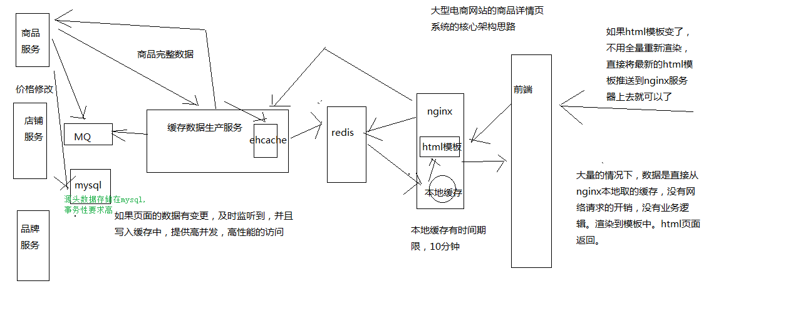

# 04_大型电商网站的异步多级缓存构建+nginx数据本地化动态渲染的架构

模板，可能所有的页面要重新渲染，很坑，大网站


#### nginx请求数据，动态渲染网页模板
分发层nginx，lua应用，会将商品id，商品店铺id，都转发到后端的应用nginx


1、应用nginx的lua脚本接收到请求
2、获取请求参数中的商品id，以及商品店铺id
3、根据商品id和商品店铺id，在nginx本地缓存中尝试获取数据
4、如果在nginx本地缓存中没有获取到数据，那么就到redis分布式缓存中获取数据，如果获取到了数据，还要设置到nginx本地缓存中


但是这里有个问题，建议不要用nginx+lua直接去获取redis数据
因为openresty没有太好的redis cluster的支持包，所以建议是发送http请求到缓存数据生产服务，由该服务提供一个http接口

缓存数生产服务可以基于redis cluster api从redis中直接获取数据，并返回给nginx


下载相关http的lua包
> cd /usr/hello/lualib/resty/  

> wget https://raw.githubusercontent.com/pintsized/lua-resty-http/master/lib/resty/http_headers.lua  

> wget https://raw.githubusercontent.com/pintsized/lua-resty-http/master/lib/resty/http.lua 


5、如果缓存数据生产服务没有在redis分布式缓存中没有获取到数据，那么就在自己本地ehcache中获取数据，返回数据给nginx，也要设置到nginx本地缓存中


6、如果ehcache本地缓存都没有数据，那么就需要去原始的服务中拉去数据，该服务会从mysql中查询，拉去到数据之后，返回给nginx，并重新设置到ehcache和redis中


这里先不考虑，后面要专门讲解一套分布式缓存重建并发冲突的问题和解决方案


7、nginx最终利用获取到的数据，动态渲染网页模板


下载网页模板相关的lua包
> cd /usr/hello/lualib/resty/
> wget https://raw.githubusercontent.com/bungle/lua-resty-template/master/lib/resty/template.lua
> mkdir /usr/hello/lualib/resty/html
> cd /usr/hello/lualib/resty/html
> wget https://raw.githubusercontent.com/bungle/lua-resty-template/master/lib/resty/template/html.lua


在/usr/hello/hello.conf的server中配置模板位置  
vi  /usr/hello/hello.conf
set $template_location "/templates";  
set $template_root "/usr/hello/templates";

创建目录并新建页面
mkdir /usr/hello/templates
vi /usr/hello/templates/product.html
```html
<html>
     <head>
            <meta http-equiv="Content-Type" content="text/html; charset=UTF-8">
            <title>商品详情页</title>
    </head>
    <body>
        商品id: {* productId *}<br/>
        商品名称: {* productName *}<br/>
        商品图片列表: {* productPictureList *}<br/>
        商品规格: {* productSpecification *}<br/>
        商品售后服务: {* productService *}<br/>
        商品颜色: {* productColor *}<br/>
        商品大小: {* productSize *}<br/>
        店铺id: {* shopId *}<br/>
        店铺名称: {* shopName *}<br/>
        店铺等级: {* shopLevel *}<br/>
        店铺好评率: {* shopGoodCommentRate *}<br/>
    </body>
</html>
```


8、将渲染后的网页模板作为http响应，返回给分发层nginx


在 vi /usr/servers/nginx/conf/nginx.conf中的http加入：
lua_shared_dict my_cache 128m;
创建lua脚本
vi /usr/hello/lua/product.lua

lua脚本中：

```lua
local uri_args = ngx.req.get_uri_args()
local productId = uri_args["productId"]
local shopId = uri_args["shopId"]
local cache_ngx = ngx.shared.my_cache
local productCacheKey = "product_info_"..productId
local shopCacheKey = "shop_info_"..shopId
local productCache = cache_ngx:get(productCacheKey)
local shopCache = cache_ngx:get(shopCacheKey)
if productCache == "" or productCache == nil then
local http = require("resty.http")
local httpc = http.new()
local resp, err = httpc:request_uri("http://192.168.31.179:8080",{
  method = "GET",
  path = "/getProductInfo?productId="..productId
})
productCache = resp.body
cache_ngx:set(productCacheKey, productCache, 10 * 60)
end


if shopCache == "" or shopCache == nil then
local http = require("resty.http")
local httpc = http.new()
local resp, err = httpc:request_uri("http://192.168.31.179:8080",{
  method = "GET",
  path = "/getShopInfo?shopId="..shopId
})
shopCache = resp.body
cache_ngx:set(shopCacheKey, shopCache, 10 * 60)
end

local cjson = require("cjson")
local productCacheJSON = cjson.decode(productCache)
local shopCacheJSON = cjson.decode(shopCache)

local context = {
    productId = productCacheJSON.id,
    productName = productCacheJSON.name,
    productPrice = productCacheJSON.price,
    productPictureList = productCacheJSON.pictureList,
    productSpecification = productCacheJSON.specification,
    productService = productCacheJSON.service,
    productColor = productCacheJSON.color,
    productSize = productCacheJSON.size,
    shopId = shopCacheJSON.id,
    shopName = shopCacheJSON.name,
    shopLevel = shopCacheJSON.level,
    shopGoodCommentRate = shopCacheJSON.goodCommentRate
}

local template = require("resty.template")
template.render("product.html", context)
```


重启nginx
> cd/usr/servers/nginx/sbin/nginx -s reload