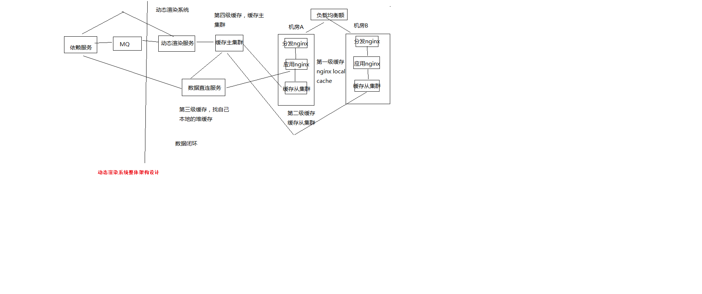

# 商品详情页动态渲染系统：架构整体设计

我们先做动态渲染那套系统

（1）依赖服务 -> MQ -> 动态渲染服务 -> 多级缓存
（2）负载均衡 -> 分发层nginx -> 应用层nginx -> 多级缓存
（3）多级缓存 -> 数据直连服务

动态渲染系统
	
数据闭环
    数据闭环架构
        依赖服务：商品基本信息，规格参数，商家/店铺，热力图，商品介绍，商品维度，品牌，分类，其他
        发送数据变更消息到MQ
        数据异构Worker集群，监听MQ，将原子数据存储到redis，发送消息到MQ
        数据聚合Worker集群，监听MQ，将原子数据按维度聚合后存储到redis，三个维度（商品基本信息、商品介绍、其他信息）
    数据闭环，就是数据的自我管理，所有数据原样同步后，根据自己的逻辑进行后续的数据加工，走系统流程，以及展示k
    数据形成闭环之后，依赖服务的抖动或者维护，不会影响到整个商品详情页系统的运行
    数据闭环的流程：数据异构（多种异构数据源拉取），数据原子化，数据聚合（按照维度将原子数据进行聚合），数据存储（Redis）

数据维度化
    商品基本信息：标题、扩展属性、特殊属性、图片、颜色尺码、规格参数
    商品介绍
    非商品维度其他信息：分类，商家，店铺，品牌
    商品维度其他信息：采用ajax异步加载，价格，促销，配送至，广告，推荐，最佳组合，等等
    
   采取ssdb，这种基于磁盘的大容量/高性能的kv存储，保存商品维度、主商品维度、商品维度其他信息，数据量大，不能光靠内存去支撑
    
   采取redis，纯内存的kv存储，保存少量的数据，比如非商品维度的其他数据，商家数据，分类数据，品牌数据
    
   一个完整的数据，拆分成多个维度，每个维度独立存储，就避免了一个维度的数据变更就要全量更新所有数据的问题
    
   不同维度的数据，因为数据量的不一样，可以采取不同的存储策略
    
系统拆分
    系统拆分更加细：依赖服务、MQ、数据异构Worker、数据同步Worker、Redis、Nginx+Lua
    每个部分的工作专注，影响少，适合团队多人协作
    异构Worker的原子数据，基于原子数据提供的服务更加灵活
    聚合Worker将数据聚合后，减少redis读取次数，提升性能
    前端展示分离为商品详情页前端展示系统和商品介绍前端展示系统，不同特点，分离部署，不同逻辑，互相不影响
    
异步化
    异步化，提升并发能力，流量削峰
    消息异步化，让各个系统解耦合，如果使用依赖服务调用商品详情页系统接口同步推送，那么就是耦合的
    缓存数据更新异步化，数据异构Worker同步调用依赖服务接口，但是异步更新redis
    
动态化
    数据获取动态化：nginx+lua获取商品详情页数据的时候，按照维度获取，比如商品基本数据、其他数据（分类、商家）
    模板渲染实时化：支持模板页面随时变化，因为采用的是每次从nginx+redis+ehcache缓存获取数据，渲染到模板的方式，因此模板变更不用重新静态化HTML
    重启应用秒级化：nginx+lua架构，重启在秒级
    需求上线快速化：使用nginx+lua架构开发商品详情页的业务逻辑，非常快速
        
多机房多活
    Worker无状态，同时部署在各自的机房时采取不同机房的配置，来读取各自机房内部部署的数据集群（redis、mysql等）
        将数据异构Worker和数据聚合Worker设计为无状态化，可以任意水平扩展
        Worker无状态化，但是配置文件有状态，不同的机房有一套自己的配置文件，只读取自己机房的redis、ssdb、mysql等数据
    每个机房配置全链路：接入nginx、商品详情页nginx+商品基本信息redis集群+其他信息redis集群、商品介绍nginx+商品介绍redis集群
    部署统一的CDN以及LVS+KeepAlived负载均衡设备