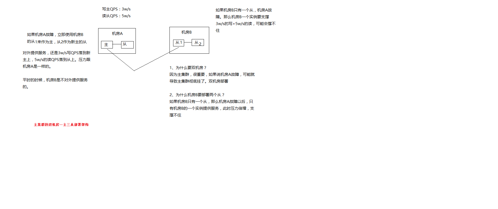

# 商品详情页动态渲染系统：大型网站的多机房4级缓存架构设计

多级缓存架构

    本地缓存
		
		使用nginx shared dict作为local cache，http-lua-module的shared dict可以作为缓存，而且reload nginx不会丢失
		
		也可以使用nginx proxy cache做local cache
		
		双层nginx部署，一层接入，一层应用，接入层用hash路由策略提升缓存命中率
			
			比如库存缓存数据的TP99为5s，本地缓存命中率25%，redis命中率28%，回源命中率47%
			
			一次普通秒杀活动的命中率，本地缓存55%，分布式redis命中率15%，回源命中率27%
			
			最高可以提升命中率达到10%
		
		全缓存链路维度化存储，如果有3个维度的数据，只有其中1个过期了，那么只要获取那1个过期的数据即可
		
		nginx local cache的过期时间一般设置为30min，到后端的流量会减少至少3倍
	
	4级多级缓存
		
		nginx本地缓存，抗热点数据，小内存缓存访问最频繁的数据
		
		各个机房本地的redis从集群的数据，抗大量离线数据，采用一致性hash策略构建分布式redis缓存集群
		
		tomcat中的动态服务的本地jvm堆缓存
			
			支持在一个请求中多次读取一个数据，或者与该数据相关的数据
			
			作为redis崩溃的备用防线
			
			固定缓存一些较少访问频繁的数据，比如分类，品牌等数据
			
			堆缓存过期时间为redis过期时间的一半
		
		主redis集群
			
			命中率非常低，小于5%
			
			防止主从同步延迟导致的数据读取miss
			
			防止各个机房的从redis集群崩溃之后，全量走依赖服务会导致雪崩，主redis集群是后备防线
	
	主redis集群，采取多机房一主三从的高可用部署架构
		
		redis集群部署采取双机房一主三活的架构，机房A部署主集群+一个从集群，机房B部署一个从集群（从机房A主集群）+一个从集群（从机房B从集群）
		
		双机房一主三活的架构，保证了机房A彻底故障的时候，机房B还有一套备用的集群，可以升级为一主一从
		
		如果采取机房A部署一主一从，机房B一从，那么机房A故障时，机房B的一从承载所有读写压力，压力过大，很难承受