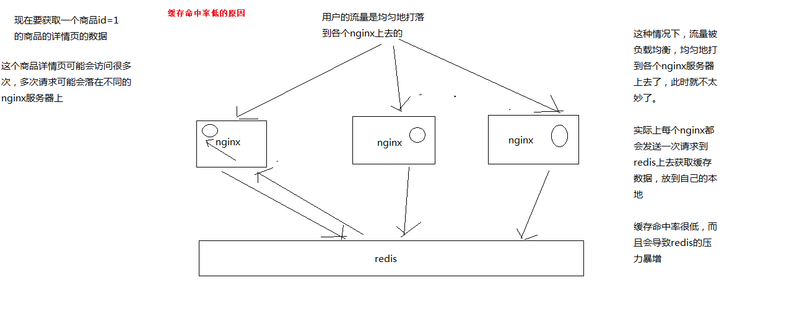
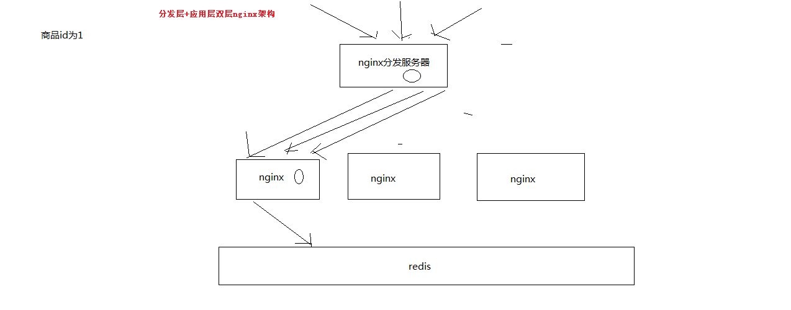

# 51_基于“分发层+应用层”双层nginx架构提升缓存命中率方案分析

1、缓存命中率低

缓存数据生产服务那一层已经搞定了，相当于三层缓存架构中的本地堆缓存+redis分布式缓存都搞定了

就要来做三级缓存中的nginx那一层的缓存了

如果一般来说，你默认会部署多个nginx，在里面都会放一些缓存，就默认情况下，此时缓存命中率是比较低的

2、如何提升缓存命中率

分发层+应用层，双层nginx

分发层nginx，负责流量分发的逻辑和策略，这个里面它可以根据你自己定义的一些规则，比如根据productId去进行hash，然后对后端的nginx数量取模

将某一个商品的访问的请求，就固定路由到一个nginx后端服务器上去，保证说只会从redis中获取一次缓存数据，后面全都是走nginx本地缓存了

后端的nginx服务器，就称之为应用服务器; 最前端的nginx服务器，被称之为分发服务器

看似很简单，其实很有用，在实际的生产环境中，可以大幅度提升你的nginx本地缓存这一层的命中率，大幅度减少redis后端的压力，提升性能

