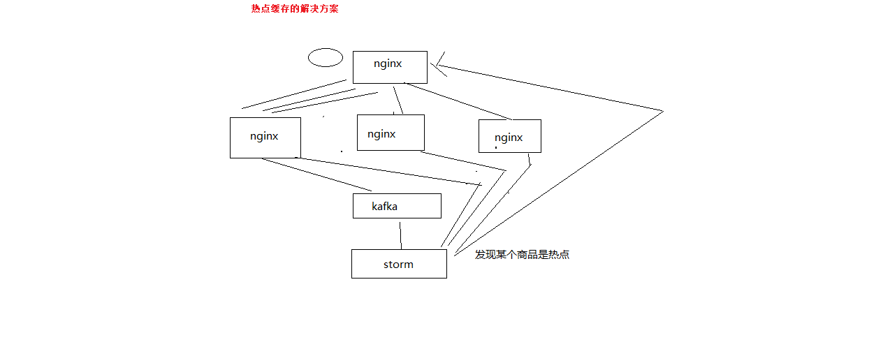

# 基于nginx+lua+storm的热点缓存的流量分发策略自动降级解决方案

1、在storm中，实时的计算出瞬间出现的热点

有很多种算法，给大家介绍一种我们的比较简单的算法

某个storm task，上面算出了1万个商品的访问次数，LRUMap

频率高一些，每隔5秒，去遍历一次LRUMap，将其中的访问次数进行排序，统计出往后排的95%的商品访问次数的平均值

1000
999
888
777
666
50
60
80
100
120

比如说，95%的商品，访问次数的平均值是100

然后，从最前面开始，往后遍历，去找有没有瞬间出现的热点数据

1000，95%的平均值（100）的10倍，这个时候要设定一个阈值，比如说超出95%平均值得n倍，5倍

我们就认为是瞬间出现的热点数据，判断其可能在短时间内继续扩大的访问量，甚至达到平均值几十倍，或者几百倍

当遍历，发现说第一个商品的访问次数，小于平均值的5倍，就安全了，就break掉这个循环

热点数据，热数据，不是一个概念

有100个商品，前10个商品比较热，都访问量在500左右，其他的普通商品，访问量都在200左右，就说前10个商品是热数据

统计出来

预热的时候，将这些热数据放在缓存中去预热就可以了

热点，前面某个商品的访问量，瞬间超出了普通商品的10倍，或者100倍，1000倍，热点

2、storm这里，会直接发送http请求到nginx上，nginx上用lua脚本去处理这个请求

storm会将热点本身对应的productId，发送到流量分发的nginx上面去，放在本地缓存中

storm会将热点对应的完整的缓存数据，发送到所有的应用nginx服务器上去，直接放在本地缓存中

3、流量分发nginx的分发策略降级

流量分发nginx，加一个逻辑，就是每次访问一个商品详情页的时候，如果发现它是个热点，那么立即做流量分发策略的降级

hash策略，同一个productId的访问都同一台应用nginx服务器上

降级成对这个热点商品，流量分发采取随机负载均衡发送到所有的后端应用nginx服务器上去

瞬间将热点缓存数据的访问，从hash分发，全部到一台nginx，变成了，负载均衡发送到多台nginx上去

避免说大量的流量全部集中到一台机器，50万的访问量到一台nginx，5台应用nginx，每台就可以承载10万的访问量

4、storm还需要保存下来上次识别出来的热点list

下次去识别的时候，这次的热点list跟上次的热点list做一下diff，看看可能有的商品已经不是热点了

热点的取消的逻辑，发送http请求到流量分发的nginx上去，取消掉对应的热点数据，从nginx本地缓存中，删除